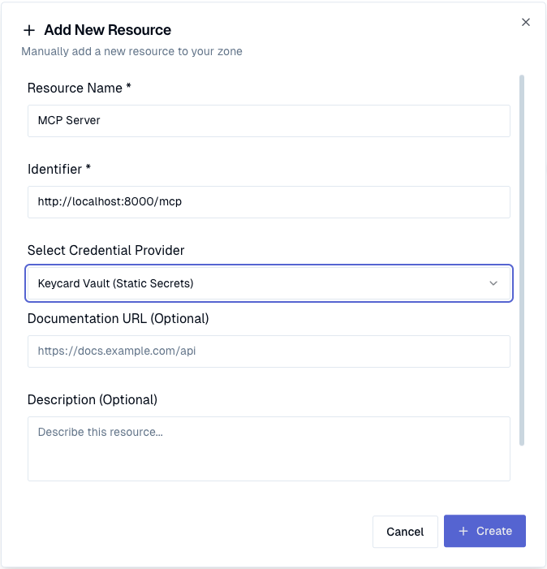

# KeyCard Python SDK

A collection of Python packages for KeyCard services, organized as a uv workspace.

## Quick Start

Get up and running with KeyCard's MCP (Model Context Protocol) integration in minutes:

### Install the Packages

```bash
pip install mcp keycardai-mcp
```

or 

```bash
uv add mcp keycardai-mcp
```

### Create Your First MCP Server

```python
from mcp.server.fastmcp import FastMCP

mcp = FastMCP("Hello World")

@mcp.tool()
def hello_world(name: str) -> str:
    return f"Hello, {name}!"

if __name__ == "__main__":
    mcp.run(transport="streamable-http")
```

### Run your MCP server

```bash
python server.py
```

For more details, refer to the [mcp](https://github.com/modelcontextprotocol/python-sdk?tab=readme-ov-file#streamable-http-transport) documentation.

### Configure the remote MCP in your AI client, like [Cursor](https://cursor.com/?from=home)

```json
{
  "mcpServers": {
    "hello-world": {
      "url": "http://localhost:8000/mcp"
    }
  }
}
```

### Test the remote server with client 


### Signup to Keycard and get your zone identifier

Refer to [docs](https://docs.keycard.ai/) on how to sign up. Navigate to Zone Settings to obtain the zone ID.


### Configure Your Preferred Identity Provider


### Setup MCP resource



### Add authentication to the MCP server

```python
from mcp.server.fastmcp import FastMCP

from keycardai.mcp.server.auth import AuthProvider

# From the zone setting above
zone_id = "90zqtq5lvtobrmyl3b0i0k2z1q"

access = AuthProvider(
   zone_id = zone_id,
   mcp_server_name="Hello World Mcp",
)

mcp = FastMCP("Minimal MCP")

@mcp.tool()
def hello_world(name: str) -> str:
    return f"Hello, {name}!"

# Create Starlette app to handle authorization flows
app = access.app(mcp)
```

### Run Your Server

The authorization flows require additional handlers to advertise the metadata.

This is implemented using the underlying Starlette application. For more information, refer to the official [mcp](https://github.com/modelcontextprotocol/python-sdk?tab=readme-ov-file#streamablehttp-servers) documentation.

You can use any async server, for example [uvicorn](https://www.uvicorn.org/):

```bash
uv add uvicorn
```

or

```bash
pip install uvicorn
```

```bash
python -m uvicorn server:app
```

### Authenticate in client


### 🎉 Your MCP server is now running with KeyCard authentication! 🎉

## Features

### Delegated Access

You can use Keycard to allow MCP servers to access other resources on behalf of the user.

It automatically requests user consent and performs necessary secure exchanges to provide granular access to resources. 

#### Configure credential provider

Configure a credential provider for your resource, for example Google Workspace.


#### Configure protected resource

Configure a protected resource, for example the Google Drive API.


#### Allow access from MCP to protected resource

To allow the MCP server to make delegated calls to the API, set the dependency on the MCP server for the protected resource.


#### Give the MCP server identity secret

In order for the MCP server to securely perform exchanges, it requires an identity secret. 


Note: Keep the client_id and client_secret safe. We will use them in the next steps.

#### Add delegation control to tool calls

Note: For demonstration, we will print a different message when access is granted.
In real use cases, you would use the token to make requests to downstream APIs.

```python
from mcp.server.fastmcp import FastMCP, Context

from keycardai.mcp.server.auth import AuthProvider, AccessContext, BasicAuth

# From the zone setting above
zone_id = "90zqtq5lvtobrmyl3b0i0k2z1q"

access = AuthProvider(
   zone_id = zone_id,
   mcp_server_name="Hello World Mcp",
   auth=BasicAuth(os.getenv("KEYCARD_CLIENT_ID"), os.getenv("KEYCARD_CLIENT_SECRET")))
)

mcp = FastMCP("Minimal MCP")

protected_resource_identifier = "https://protected-api"

@mcp.tool()
@access.grant(protected_resource_identifier)
def hello_world(ctx: Context, access_context: AccessContext, name: str) -> str:
    msg = f"Hello, {name}!"
    if access_context.access(protected_resource_identifier).access_token:
      msg = f"Hello, {name}! I can see you have extra access"
    return msg

# Create Starlette app to handle authorization flows
app = access.app(mcp)
```

#### Use obtained access to make API calls on behalf of users


## Overview

This workspace contains multiple Python packages that provide various KeyCard functionality:

- **keycardai-oauth**: OAuth 2.0 implementation with support for RFC 8693 (Token Exchange)
- **keycardai-mcp**: Core MCP (Model Context Protocol) integration utilities
- **keycardai-mcp-fastmcp**: FastMCP-specific integration package with decorators and middleware

## Installation

Install the SDK packages using pip:

```bash
# Install individual packages as needed
pip install keycardai-oauth
pip install keycardai-mcp
pip install keycardai-mcp-fastmcp

# Or install from source
git clone git@github.com:keycardai/python-sdk.git
cd python-sdk
pip install ./packages/oauth
pip install ./packages/mcp
pip install ./packages/mcp-fastmcp
```

## Documentation

Comprehensive documentation is available at our [documentation site](https://docs.keycard.ai), including:
- API reference for all packages
- Usage examples and tutorials
- Integration guides
- Architecture decisions

## Examples

Each package includes practical examples in their respective `examples/` directories:

- **OAuth examples**: Anonymous token exchange, server discovery, dynamic registration
- **MCP examples**: Google API integration with delegated token exchange

For detailed examples and usage patterns, see our [documentation](https://docs.keycard.ai).

## License

This project is licensed under the MIT License - see the LICENSE file for details.

## Support

For questions, issues, or support:

- GitHub Issues: [https://github.com/keycardai/python-sdk/issues](https://github.com/keycardai/python-sdk/issues)
- Documentation: [https://docs.keycardai.com](https://docs.keycard.ai/)
- Email: support@keycard.ai