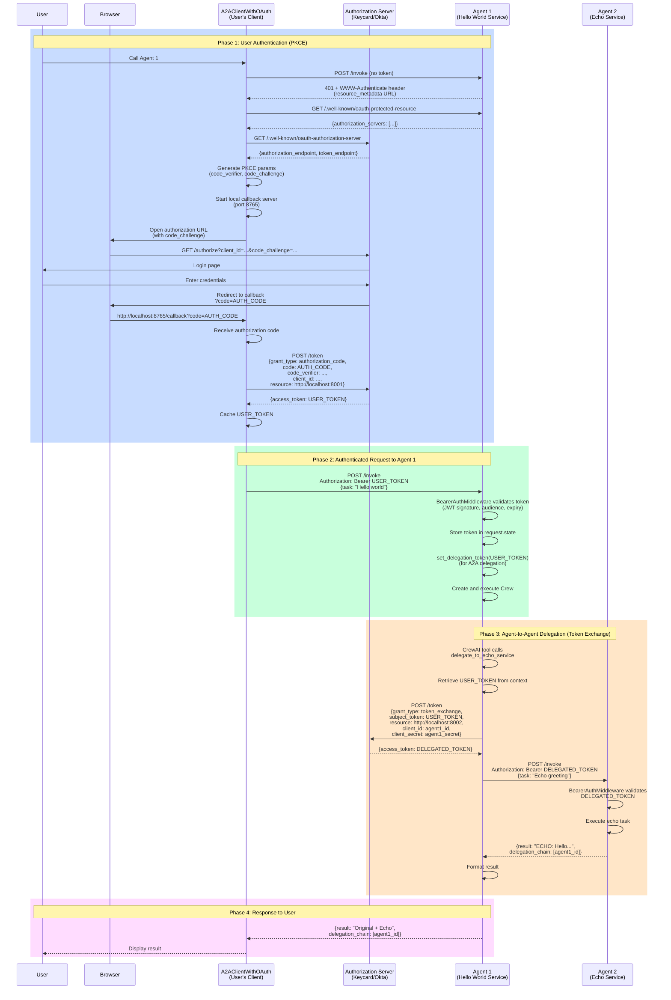

# OAuth Authentication and A2A Delegation Flow

This document describes how OAuth authentication and Agent-to-Agent (A2A) delegation work together in the KeycardAI agents framework.

## Architecture Diagram



---

## Detailed Flow Description

### Phase 1: User Authentication (PKCE Flow)

**Goal**: User authenticates and obtains an access token for Agent 1

1. **Initial Request (No Token)**
   - Client attempts to call Agent 1's `/invoke` endpoint without authentication
   - Agent 1 returns `401 Unauthorized` with `WWW-Authenticate` header containing OAuth metadata URL

2. **OAuth Discovery**
   - Client fetches OAuth protected resource metadata from Agent 1
   - Client discovers authorization server endpoints (authorization, token)

3. **PKCE Preparation**
   - Client generates random `code_verifier` (64-byte random string)
   - Client computes `code_challenge` = BASE64URL(SHA256(code_verifier))
   - Client starts local HTTP server on port 8765 to receive OAuth callback

4. **User Login**
   - Client opens browser to authorization endpoint with:
     - `client_id`: OAuth client identifier
     - `redirect_uri`: `http://localhost:8765/callback`
     - `code_challenge`: PKCE challenge
     - `resource`: Target service URL (`http://localhost:8001`)
   - User enters credentials in browser
   - Authorization server validates and redirects back with `code`

5. **Token Exchange**
   - Client receives authorization code via callback
   - Client exchanges code for access token:
     - Includes `code_verifier` to prove it initiated the flow
     - Uses client credentials (client_id + client_secret) if confidential client
     - Requests token scoped to Agent 1 (`resource` parameter)
   - Authorization server validates and returns `USER_TOKEN`
   - Client caches token for subsequent requests

### Phase 2: Authenticated Request to Agent 1

**Goal**: User's authenticated request reaches Agent 1

1. **Request with Token**
   - Client sends POST to `/invoke` with `Authorization: Bearer USER_TOKEN`
   - Includes task description and inputs in request body

2. **Token Validation**
   - `BearerAuthMiddleware` intercepts request
   - Validates JWT token:
     - **Signature**: Verifies token was issued by trusted authorization server
     - **Audience**: Confirms token is intended for this service (`http://localhost:8001`)
     - **Expiry**: Checks token hasn't expired
   - Extracts token claims (subject, client_id, etc.)

3. **Context Setup**
   - Token and claims stored in `request.state.keycardai_auth_info`
   - `set_delegation_token(USER_TOKEN)` called to store token in context variable
   - This makes token available to CrewAI tools for delegation

4. **Crew Execution**
   - Agent 1 creates Crew instance
   - Crew processes task using available tools

### Phase 3: Agent-to-Agent Delegation (Token Exchange)

**Goal**: Agent 1 delegates work to Agent 2 on behalf of the user

1. **Delegation Tool Called**
   - CrewAI agent decides to use `delegate_to_echo_service` tool
   - Tool retrieves `USER_TOKEN` from context variable

2. **Token Exchange for Delegation**
   - Agent 1 calls authorization server's token endpoint:
     - **Grant Type**: `urn:ietf:params:oauth:grant-type:token-exchange`
     - **Subject Token**: `USER_TOKEN` (the user's token)
     - **Resource**: Target service URL (`http://localhost:8002`)
     - **Client Authentication**: Agent 1's `client_id` + `client_secret`
   - Authorization server:
     - Validates `USER_TOKEN`
     - Verifies Agent 1 is authorized to request tokens for Agent 2
     - Issues new `DELEGATED_TOKEN` with:
       - Audience: `http://localhost:8002` (Echo service)
       - Claims: Preserves user identity (subject)
       - Delegation chain: Records Agent 1 as delegator

3. **Invoke Agent 2**
   - Agent 1 calls Agent 2's `/invoke` endpoint with `DELEGATED_TOKEN`
   - Agent 2's middleware validates the delegated token
   - Agent 2 processes the task

4. **Response**
   - Agent 2 returns result with updated delegation chain
   - Agent 1 receives response and formats it

### Phase 4: Response to User

**Goal**: Return combined results to user

1. **Combine Results**
   - Agent 1 combines its own processing with Agent 2's response
   - Includes delegation chain for audit trail

2. **Return to Client**
   - Response includes:
     - Task result
     - Delegation chain showing which services were called
   - Client displays result to user

---

## Key Components

### Client Side

#### `A2AServiceClientWithOAuth`
- **Location**: `packages/agents/src/keycardai/agents/a2a_client_oauth.py`
- **Purpose**: Handles PKCE authentication flow for users
- **Features**:
  - OAuth discovery from `WWW-Authenticate` headers
  - PKCE parameter generation
  - Local callback server for OAuth redirect
  - Token caching
  - Automatic retry with authentication on 401

#### Configuration
```python
client = A2AServiceClientWithOAuth(
    service_config=config,
    redirect_uri="http://localhost:8765/callback",  # Must be registered
    callback_port=8765,
    scopes=[]  # Optional OAuth scopes
)
```

### Server Side

#### `BearerAuthMiddleware`
- **Location**: `packages/mcp/src/keycardai/mcp/server/middleware/bearer.py`
- **Purpose**: Validates JWT Bearer tokens on incoming requests
- **Validation**:
  - JWT signature verification
  - Audience claim validation
  - Expiry check
  - Issuer verification

#### `AgentServiceConfig`
- **Location**: `packages/agents/src/keycardai/agents/service_config.py`
- **Purpose**: Configure agent service with OAuth
- **Key Fields**:
  - `client_id`: Service's OAuth client ID
  - `client_secret`: Service's OAuth client secret
  - `authorization_server_url`: Custom OAuth server URL (optional)
  - `identity_url`: Service's public URL
  - `zone_id`: Keycard zone identifier

#### OAuth Metadata Endpoints
- **`/.well-known/oauth-protected-resource`**: Resource metadata (authorization servers)
- **`/.well-known/oauth-authorization-server`**: Authorization server discovery
- **`/.well-known/agent-card.json`**: Service capabilities (public)
- **`/status`**: Health check (public)
- **`/invoke`**: Protected endpoint requiring authentication

### Delegation

#### `A2AServiceClient` / `A2AServiceClientSync`
- **Location**: `packages/agents/src/keycardai/agents/a2a_client.py`
- **Purpose**: Server-to-server delegation with token exchange
- **Features**:
  - OAuth token exchange (RFC 8693)
  - Automatic token acquisition
  - Service discovery via agent cards

#### Context Variable Pattern
```python
# Set token before crew execution
set_delegation_token(user_access_token)

# Tools retrieve token from context
user_token = _current_user_token.get()

# Use for delegation
client.invoke_service(
    service_url,
    task,
    subject_token=user_token  # For token exchange
)
```

---

## Security Features

### 🔒 PKCE (Proof Key for Code Exchange)
- **Prevents**: Authorization code interception attacks
- **How**: Code challenge proves the client that started the flow is the same one exchanging the code
- **Use Case**: Protects public clients (desktop apps, CLIs) without client secrets

### 🔒 Token Exchange (RFC 8693)
- **Purpose**: Securely delegate user's authority to downstream services
- **Benefits**:
  - Maintains user identity across services
  - Each service gets appropriately scoped token
  - Full audit trail via delegation chain
- **Security**: Service must authenticate to get delegated tokens

### 🔒 JWT Validation
- **Signature**: Cryptographically verifies token authenticity
- **Audience**: Ensures token is intended for this specific service
- **Expiry**: Prevents use of expired tokens
- **Issuer**: Confirms token from trusted authorization server

### 🔒 Delegation Chain
- **Purpose**: Audit trail of service calls
- **Content**: List of service client IDs that processed the request
- **Benefits**:
  - Security auditing
  - Debugging
  - Compliance tracking

### 🔒 Scoped Tokens
- **Principle**: Each token only valid for specific resource
- **Implementation**: `resource` parameter in token requests
- **Benefit**: Limits blast radius if token is compromised

---

## Configuration Examples

### Client Configuration

```python
from keycardai.agents import AgentServiceConfig, A2AServiceClientWithOAuth

# Configure client
config = AgentServiceConfig(
    service_name="My Client",
    client_id="my_client_id",
    client_secret="my_client_secret",  # Optional for confidential clients
    identity_url="http://localhost:9000",
    zone_id="my_zone_id",
    authorization_server_url="https://oauth.example.com"  # Optional custom URL
)

# Create OAuth-enabled client
client = A2AServiceClientWithOAuth(
    service_config=config,
    redirect_uri="http://localhost:8765/callback",
    callback_port=8765
)

# Call protected service (automatic authentication)
result = await client.invoke_service(
    service_url="http://localhost:8001",
    task="Hello world"
)
```

### Server Configuration

```python
from keycardai.agents import AgentServiceConfig, create_agent_card_server
import uvicorn

# Configure service
config = AgentServiceConfig(
    service_name="Hello World Agent",
    client_id="agent1_client_id",
    client_secret="agent1_client_secret",
    identity_url="http://localhost:8001",
    zone_id="my_zone_id",
    authorization_server_url="https://oauth.example.com",  # Optional
    description="Agent service that greets users",
    capabilities=["greeting", "hello_world"],
    crew_factory=create_my_crew  # Your CrewAI crew factory
)

# Create server
app = create_agent_card_server(config)

# Run server
uvicorn.run(app, host="0.0.0.0", port=8001)
```

### Delegation Configuration (CrewAI)

```python
from keycardai.agents.integrations.crewai_a2a import get_a2a_tools

# Define services to delegate to
delegatable_services = [
    {
        "name": "echo_service",
        "url": "http://localhost:8002",
        "description": "Echo service that repeats messages",
    }
]

# Get A2A tools
a2a_tools = await get_a2a_tools(config, delegatable_services)

# Use in CrewAI agent
agent = Agent(
    role="Orchestrator",
    tools=a2a_tools,  # Includes delegate_to_echo_service tool
    allow_delegation=True
)
```

---

## Token Types

### USER_TOKEN
- **Source**: User authentication via PKCE
- **Audience**: Specific agent service (e.g., `http://localhost:8001`)
- **Purpose**: Authenticate user to first agent
- **Lifetime**: Typically 1 hour
- **Contains**: User identity (subject), client_id, scopes

### DELEGATED_TOKEN
- **Source**: Token exchange by upstream service
- **Audience**: Target service (e.g., `http://localhost:8002`)
- **Purpose**: Authenticate delegated request
- **Lifetime**: Typically shorter than USER_TOKEN
- **Contains**: Original user identity, delegation chain, requesting service ID

---

## OAuth Endpoints

### Protected Resource Metadata
```
GET /.well-known/oauth-protected-resource{path}
```
Returns OAuth metadata for the protected resource, including authorization servers.

**Example Response**:
```json
{
  "resource": "http://localhost:8001/invoke",
  "authorization_servers": [
    "https://oauth.example.com/"
  ],
  "jwks_uri": "http://localhost:8001/.well-known/jwks.json"
}
```

### Authorization Server Metadata
```
GET /.well-known/oauth-authorization-server
```
Proxies to authorization server's discovery endpoint.

**Example Response**:
```json
{
  "issuer": "https://oauth.example.com/",
  "authorization_endpoint": "https://oauth.example.com/oauth/2/authorize",
  "token_endpoint": "https://oauth.example.com/oauth/2/token",
  "jwks_uri": "https://oauth.example.com/openidconnect/jwks"
}
```

---

## Error Handling

### 401 Unauthorized
**Causes**:
- Missing or invalid token
- Token expired
- Token signature invalid
- Wrong audience

**Response Headers**:
```
WWW-Authenticate: Bearer error="invalid_token", 
                  error_description="Token verification failed",
                  resource_metadata="http://localhost:8001/.well-known/oauth-protected-resource/invoke"
```

**Client Action**:
- Extract `resource_metadata` URL
- Perform OAuth discovery
- Acquire new token
- Retry request

### 403 Forbidden
**Causes**:
- Valid token but insufficient permissions
- Service not authorized to delegate

**Client Action**:
- Check token scopes
- Verify service permissions in authorization server

---

## Troubleshooting

### Issue: "404 Not Found" on OAuth metadata endpoints
**Cause**: Routing misconfiguration
**Solution**: Ensure routes are not double-prefixed (e.g., `/.well-known/.well-known/...`)

### Issue: "401 Unauthorized" during delegation
**Causes**:
1. Token not passed to delegation tools
2. Wrong authorization server URL
3. Token exchange not configured

**Solutions**:
1. Verify `set_delegation_token()` is called before crew execution
2. Check `authorization_server_url` in `AgentServiceConfig`
3. Ensure service has `client_secret` for token exchange

### Issue: "Token verification failed" with audience mismatch
**Cause**: Token requested for wrong resource
**Solution**: Use base service URL (e.g., `http://localhost:8001`) not full path (`http://localhost:8001/invoke`)

### Issue: "Unauthorized redirect URI"
**Cause**: Redirect URI not registered with OAuth client
**Solution**: Register `http://localhost:8765/callback` (or your custom URI) in authorization server for the client

---

## Standards and RFCs

- **OAuth 2.0**: [RFC 6749](https://tools.ietf.org/html/rfc6749)
- **PKCE**: [RFC 7636](https://tools.ietf.org/html/rfc7636)
- **Token Exchange**: [RFC 8693](https://tools.ietf.org/html/rfc8693)
- **JWT**: [RFC 7519](https://tools.ietf.org/html/rfc7519)
- **OAuth Discovery**: [RFC 8414](https://tools.ietf.org/html/rfc8414)
- **Bearer Tokens**: [RFC 6750](https://tools.ietf.org/html/rfc6750)

